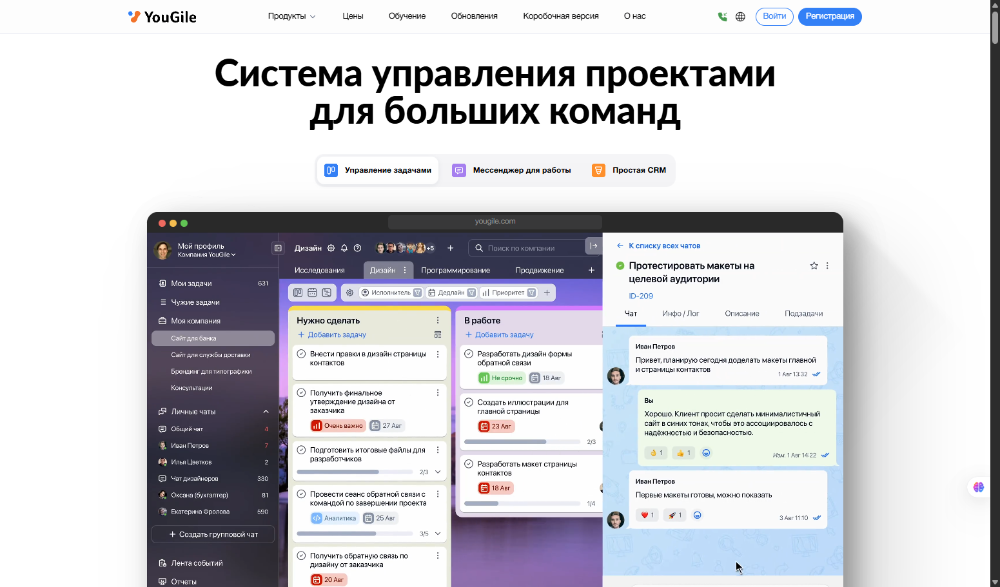
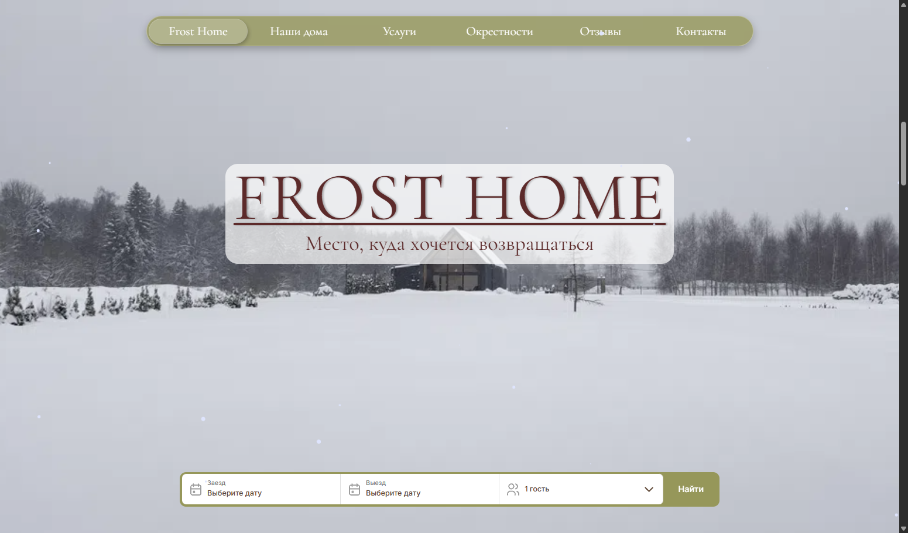
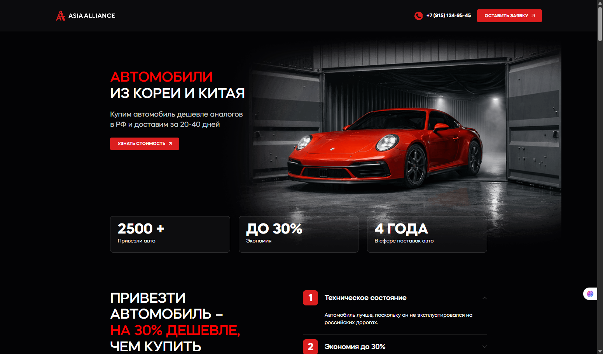
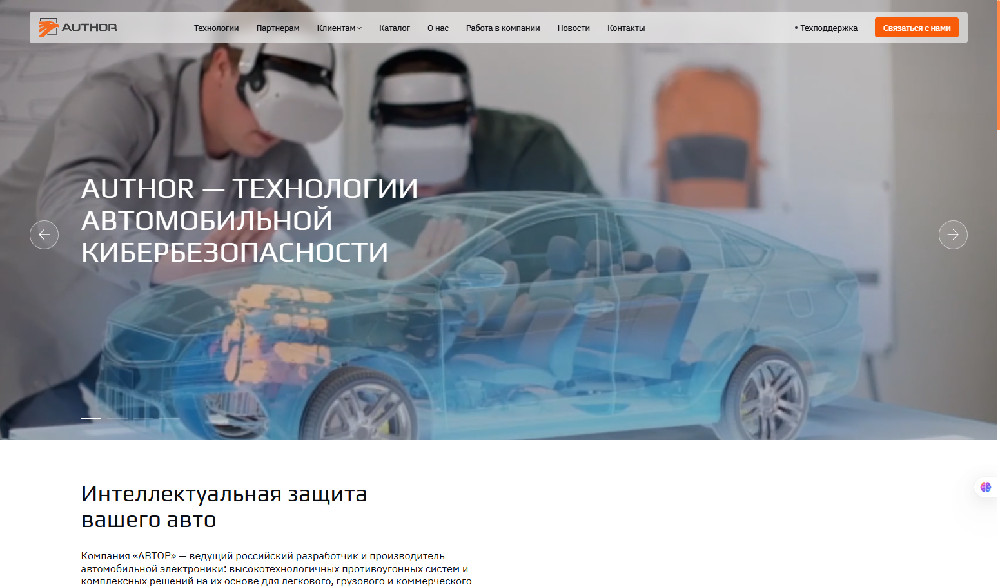
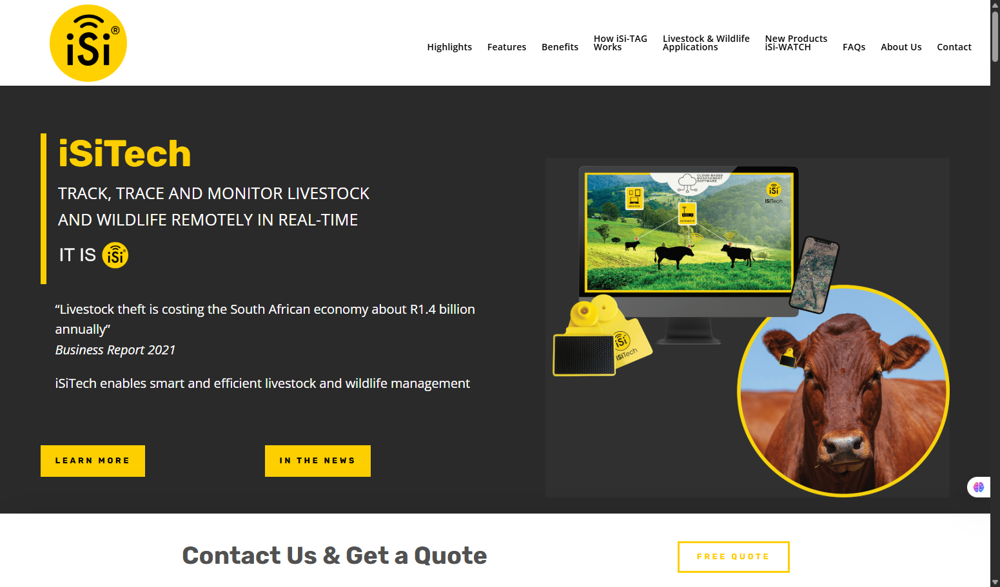

  
  

    
    
    
    
  

---

## 👋 Mikhail Granin

**Fullstack & Product Engineer**  
Building and scaling real products, not just interfaces.

I work at the intersection of engineering, product thinking, and execution.  
I help turn unclear ideas into stable, scalable systems and bring them to production.

---

## 🎯 Focus

- Product-oriented fullstack development
- Architecture and technical decision-making
- Internal systems, admin panels, and complex business logic
- Performance, UX, and long-term maintainability
- Leading and aligning small technical teams

---

## 🛠️ Stack

**Frontend**  

**Backend**  

**Infrastructure**  

---

## 🚀 Portfolio

Real products and systems I've worked on:

<table>
<tr>
<td colspan="2" valign="top" align="center">

### [YouGile](https://ru.yougile.com/)

Browser extensions, CRM integrations, and core platform features.  
**Role:** Developer in Dream Team

</td>
</tr>
<tr>
<td width="50%" valign="top">

### [Frost Home](https://frost-home.ru/)

Full-cycle product from scratch. First month reached half-year revenue target.  
**Role:** Lead, Fullstack

</td>
<td width="50%" valign="top">

### [AsiaAlliance](https://asiaalliance.ru/)

Admin panel, redesign, performance recovery, team leadership.  
**Role:** Tech Lead

</td>
</tr>
<tr>
<td width="50%" valign="top">

### [Author Alarm](https://author-alarm.ru/)

Internal admin system for insurance, support, and finance departments.  
**Role:** Frontend, Architecture cleanup

</td>
<td width="50%" valign="top">

### [iSiTech](https://isitech.co.za/)

Monitoring interface for animal sensors.  
**Role:** Frontend, Design

</td>
</tr>
</table>

---

## 📫 Contact

**Telegram:** [@gramizor](https://t.me/gramizor)  
**Channel:** [@grmzr_redir](https://t.me/grmzr_redir)
